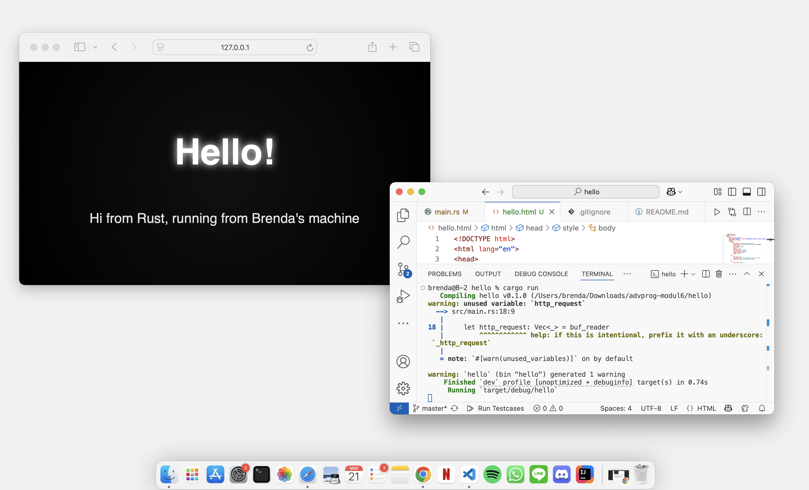
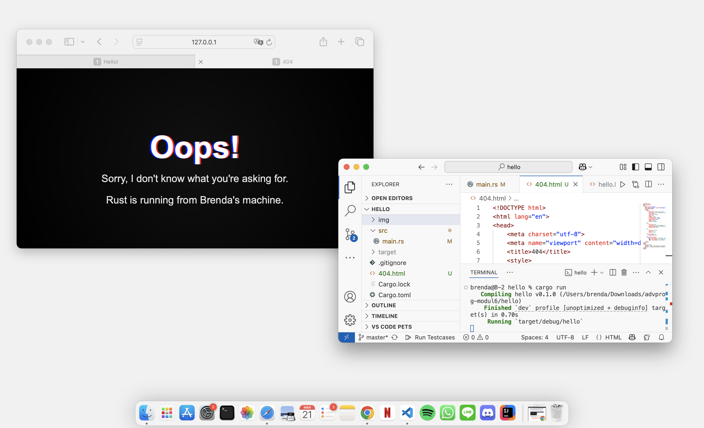

# Modul 6 Pemrograman Lanjut : Concurrency
oleh **Brenda Po Lok Fahida**

<br>
<br>

## **Milestone 1: Single Threaded Web Server**

Saat mengikuti langkah-langkah bagian Milestone 1 dalam tutorial ini, saya melakukan research tambahan untuk memahami konsep dan implementasinya dengan lebih baik. Berikut ini adalah refleksi saya berdasarkan pemahaman yang saya peroleh.

Program ini menggunakan `TcpListener` untuk mendengarkan permintaan masuk pada alamat `127.0.0.1:7878`. Setiap kali ada koneksi baru, program akan mencetak **"Connection established!"** di terminal sebagai tanda bahwa koneksi berhasil dibuat. Konsep utama yang digunakan adalah pemanfaatan **Transmission Control Protocol (TCP)**, yang memastikan bahwa data dikirim dengan urutan yang benar dan tanpa kehilangan selama proses komunikasi antara klien dan server.

Beberapa fungsi utama yang digunakan dalam program ini antara lain:

- `bind()` digunakan untuk menghubungkan `TcpListener` dengan alamat dan port tertentu agar dapat menerima koneksi.
- `unwrap()` berguna untuk mengekstrak nilai dari `Result` atau `Option`, tetapi berisiko menyebabkan **panic** jika terjadi error.
- `incoming()` menyediakan iterator yang menangani koneksi yang masuk satu per satu sebelum diproses lebih lanjut.

Untuk menangani koneksi yang diterima, dibuat fungsi `handle_connection()`. Fungsi ini membaca permintaan HTTP dari klien menggunakan `BufReader`, yang membantu dalam membaca **stream data** dari `TcpStream` dan memprosesnya baris per baris. Permintaan HTTP yang diterima dikumpulkan dalam variabel `http_request` dan kemudian ditampilkan di konsol.

Meskipun server ini sudah dapat menerima permintaan, ada beberapa keterbatasan yang perlu diperhatikan:

1. **Single-threaded**: Server hanya dapat menangani satu koneksi dalam satu waktu. Jika ada banyak permintaan masuk secara bersamaan, server bisa mengalami **bottleneck** dan memperlambat respons ke klien.
2. **Tidak ada mekanisme error handling yang optimal**: Penggunaan `unwrap()` berisiko menyebabkan program berhenti jika terjadi kesalahan saat menerima koneksi atau membaca data. Dalam proyek yang lebih besar, **error handling** yang lebih baik sangat penting untuk menjaga stabilitas aplikasi.

Langkah selanjutnya dalam pengembangan server ini adalah meningkatkan fungsionalitasnya agar dapat mengirim respons HTML, serta menerapkan mekanisme multi-threading agar dapat menangani lebih dari satu koneksi dalam satu waktu. Saya akan terus mengikuti tutorial ini untuk memahami lebih dalam bagaimana server bekerja dan bagaimana meningkatkan performanya.

<br>

## **Milestone 2: Returning HTML**

Sebagai bagian dari milestone berikutnya, yaitu Milestone 2: Returning HTML, saya mulai memahami bagaimana server dapat memberikan respons dalam bentuk halaman HTML kepada klien. Pada tahap ini, saya mempelajari cara membaca file HTML dari sistem file dan mengirimkannya sebagai respons HTTP.

Dalam implementasinya, server membaca isi file "hello.html" menggunakan fungsi fs::read_to_string(). File ini kemudian dikirim sebagai bagian dari respons HTTP dengan menyertakan header "Content-Length" untuk memberi tahu browser ukuran konten yang dikirim. Saya juga mempelajari bagaimana format HTTP response bekerja dan pentingnya menyusun header dengan benar agar browser dapat memahami dan merender halaman yang diterima.

Melalui milestone ini, saya semakin memahami bagaimana web server bekerja dalam menangani permintaan dan memberikan respons yang sesuai. Saya juga menyadari pentingnya menangani kesalahan dengan lebih baik, misalnya dengan memeriksa apakah file HTML tersedia sebelum mencoba membacanya, untuk menghindari error yang tidak diharapkan.

Berikut ini adalah dokumentasi pengerjaan Milestone 2 berupa screenshot hasil eksekusi perintah `cargo run` pada `http://127.0.0.1:7878`



<br>


## **Milestone 3: Validating request and selectively responding**

Pada Milestone 3: Validating Request dan Selectively Responding, saya mempelajari bagaimana server dapat merespons permintaan klien berdasarkan URL yang diminta. Pada tahap ini, saya menambahkan validasi pada request HTTP sehingga server dapat membedakan antara halaman yang tersedia dan tidak tersedia. Jika klien meminta halaman utama dengan `GET / HTTP/1.1`, server akan merespons dengan "hello.html" dan status `HTTP/1.1 200 OK`. Jika klien meminta halaman yang tidak dikenal, server akan mengembalikan "404.html" dengan status `HTTP/1.1 404 NOT FOUND`.

Implementasi ini dilakukan dengan membaca baris pertama dari permintaan HTTP menggunakan BufReader. Kemudian, kondisi if digunakan untuk mengevaluasi apakah permintaan sesuai dengan halaman utama atau tidak. Setelah menentukan file yang harus dibaca, server mengirimkan respons dengan konten yang sesuai.

Dari milestone ini, saya belajar lebih dalam tentang cara kerja validasi request dalam server dan bagaimana server dapat menangani halaman yang tidak ditemukan. Selain itu, saya juga semakin memahami pentingnya menangani berbagai jenis request secara efisien agar server dapat memberikan pengalaman yang lebih baik kepada pengguna.

Berikut ini adalah dokumentasi pengerjaan Milestone 3 berupa screenshot hasil eksekusi perintah `cargo run` pada `http://127.0.0.1:7878/bad`



<br>

## **Milestone 4: Simulation Slow Response**

Pada Milestone 4: Simulation slow response, saya mempelajari bagaimana server menangani permintaan yang membutuhkan waktu lebih lama untuk diproses. Dalam implementasi ini, saya menambahkan kasus ketika klien mengakses `GET /sleep HTTP/1.1`, server akan melakukan penundaan selama 10 detik sebelum mengirim respons. Penundaan ini dilakukan menggunakan `thread::sleep(Duration::from_secs(10))` untuk mensimulasikan kondisi di mana server menghadapi proses yang lambat.

Melalui milestone ini, saya menyadari pentingnya menangani permintaan yang membutuhkan waktu lama agar server tetap responsif dan tidak menghambat permintaan lainnya. Dari sini, saya semakin memahami mengapa implementasi multi-threading sangat penting dalam meningkatkan performa server, terutama dalam menangani banyak permintaan secara bersamaan.

<br>

## **Milestone 5: Multithreaded Server**

Setelah memahami bagaimana server menangani permintaan dengan single-threaded pada milestone sebelumnya, saya menyadari bahwa server memiliki keterbatasan dalam menangani beberapa koneksi secara bersamaan. Pada Milestone 4, ketika ada permintaan yang membutuhkan waktu lama untuk diproses, seperti `/sleep`, permintaan lainnya harus menunggu hingga proses tersebut selesai. Hal ini membuat saya semakin memahami pentingnya implementasi multi-threading untuk meningkatkan efisiensi server. Oleh karena itu, pada Milestone 5, saya mengimplementasikan **ThreadPool** untuk memungkinkan server menangani banyak permintaan secara simultan tanpa saling menunggu.

Dalam implementasi kode ini, **ThreadPool** digunakan untuk mengelola eksekusi tugas secara konkuren dengan membagi beban kerja ke beberapa thread pekerja (*Worker*). Saat server menerima request melalui `TcpListener`, request tersebut tidak langsung diproses dalam thread utama, melainkan dikirim ke salah satu thread dalam pool menggunakan `pool.execute(|| { handle_connection(stream); })`. Dengan mekanisme ini, beberapa request dapat diproses secara bersamaan tanpa menyebabkan bottleneck.

**ThreadPool** dibuat dengan jumlah thread tetap yang ditentukan saat inisialisasi. Setiap **Worker** dalam pool menjalankan loop yang terus menerima tugas dari `mpsc::Receiver<Job>`, yang telah dikunci dengan `Arc<Mutex<T>>` untuk memastikan akses aman dari beberapa thread. Ketika thread pekerja menerima tugas, ia akan mengeksekusinya lalu kembali menunggu tugas berikutnya. Jika receiver berhenti mengirim tugas, thread akan keluar dari loop dan berhenti bekerja.

Pada modifikasi kode di `main.rs`, server dibuat menggunakan `TcpListener` pada `127.0.0.1:7878` seperti sebelumnya, tetapi dengan tambahan **ThreadPool** yang memungkinkan eksekusi request secara paralel. Saat ada koneksi masuk, request tersebut dikirim ke **ThreadPool** dan ditangani oleh salah satu thread yang tersedia. Dengan cara ini, server dapat menangani request yang membutuhkan waktu lama, seperti `/sleep`, tanpa menghambat eksekusi request lainnya. Hal ini secara signifikan meningkatkan efisiensi dan performa server dalam menangani banyak klien sekaligus.

Melalui milestone ini, saya semakin memahami bagaimana konsep concurrency dan paralelisme bekerja dalam pengembangan server. Saya juga menyadari pentingnya pengelolaan sumber daya agar server dapat bekerja secara optimal tanpa menghabiskan terlalu banyak memori atau CPU. Implementasi ini memberikan wawasan yang lebih mendalam mengenai bagaimana sistem multi-threading dapat diterapkan untuk meningkatkan skalabilitas aplikasi server.

<br> 

## **Bonus Reflection**

Setelah berhasil mengimplementasikan **ThreadPool**, saya melakukan perbaikan lebih lanjut dengan mengganti metode `new` menjadi `build`. Perubahan ini bertujuan untuk meningkatkan keandalan dan keamanan dalam pembuatan thread pool dengan menambahkan mekanisme penanganan error yang lebih baik.

Sebelumnya, metode `new` langsung menginisialisasi `ThreadPool` tanpa validasi ukuran atau kemungkinan penanganan error. Namun, setelah mempertimbangkan aspek ketahanan kode, perlu menggantinya dengan `build`, yang mengembalikan `Result<ThreadPool, &'static str>`. Dengan pendekatan ini, jika ada upaya membuat thread pool dengan ukuran 0, program tidak akan langsung panic, tetapi akan mengembalikan error yang dapat ditangani dengan lebih baik.

Selain itu, perubahan ini juga meningkatkan keterbacaan dan maintainability kode karena pola penggunaan `build` lebih sesuai dengan praktik terbaik dalam Rust, yaitu menggunakan `Result` untuk menangani kemungkinan kegagalan dalam pembuatan objek. Dalam `main.rs`, inisialisasi thread pool kini dilakukan dengan:

```rust
let pool = ThreadPool::build(4).expect("Failed to create thread pool");
```

Pendekatan ini memastikan bahwa jika terjadi kesalahan dalam pembuatan thread pool, error akan langsung diketahui dengan pesan yang jelas, tanpa menyebabkan crash yang tidak terkendali.

Dari perubahan ini, saya semakin memahami pentingnya desain API yang aman dan ergonomis. Implementasi ini juga memperkuat pemahaman saya tentang bagaimana Rust menangani error secara eksplisit melalui `Result`, sehingga kode menjadi lebih robust dan lebih mudah untuk diuji. 
